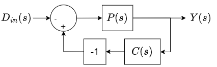
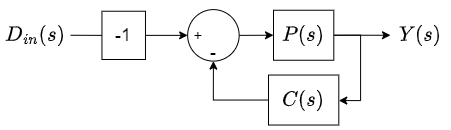
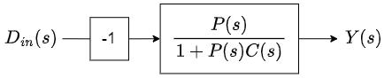
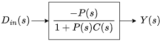

# Objectifs de la séance

Nous avons à présent vu tout un tas de principes de base utiles pour réguler des systèmes ***SISO*** (***S**ingle **I**nput **S**ingle **O**utput*).

Néanmoins, ce qui a été étudié jusqu'à présent n'est applicable qu'au niveau de la théorie, mais certains défis apparaissent si l'on applique ces techniques en réalité. Cette séance abordera donc les défis rencontrés lors de la régulation de systèmes réels et proposera des outils pour les surmonter. Nous conclurons la séance par la présentation d'une technique permettant de simplifier, **sous certaines conditions**, la fonction de transfert d'un système afin de faciliter/rendre possible le dimensionnement d'un régulateur.

Pour commencer, étudions la prise en compte des perturbations que notre système peut subir et leur impact sur sa réaction !

# Perturbations

Si on reprend le schémas général d'un système asservi qui a été présenté lors de la séance d'introduction au cours (), on a :

:::{figure} images/Seance5/generalFeedbackSystem.png
:label: generalFeedbackSystem_S5
:alt: Représentation général d'un système asservis
:align: center

Représentation général d'un système asservis avec une consigne $r(t)$, des perturbations $d_{in}(t)$ et $d_{out}(t)$ et du bruit sur la mesure $n(t)$
:::

Les $d_{in}(t)$ et $d_{out}(t)$ représentent les perturbations (*disturbances*)[^disturbances] en entrée et en sortie du système et le  $n(t)$ (*noise*)[^noise] représente le bruit sur la mesure. On a appris à dimensionner notre correcteur pour maîtriser la robustesse du système à asservir en observant sa réponse dans le domaine fréquentiel (avec les marges de gain et de fréquence) et/ou en observant les positions de ses pôles (plus leurs parties rélles sont négatives, plus l'amortissement est grand et donc le système robuste). Néanmoins, nous n'avons pas encore prouvé que le système est d'autant plus robuste aux perturbations et/ou bruit que ces marges sont importantes ! Nous avons juste pu voir que la réponse de notre système était d'autant plus amortie que nos marges étaient grandes et on en a déduit que le système était donc plus robuste mais comment vérifier cela en réalité ? 🤔

En fait, nous avons affaire à un système ***MISO*** (***M**uliple **I**nput **S**ingle **O**utput*) contrairement à ce qu'on a eu jusque maintenant où nous n'avions qu'une seule entrée et une seule sortie ($\rightarrow$ SISO). Pour résoudre ce problème, nous allons utiliser une technique de résolution que vous connaissez fort bien maintenant après tous ces cours d'électronique : le ***théorème de superposition*** ! 🤓

On va donc regarder **indépendamment l'impact de chaque entrée** de notre système sur la sortie de ce dernier **et sommer l'ensemble** pour obtenir la fonction de transfert globale de notre système.

Commençons par le plus simple en regardant juste l'impact de $r(t)$:

1. On mets tous les autres signaux d'entrée à 0 $\Rightarrow d_{in}(t) = d_{out}(t) = n(t) = 0$

2. On obtient le schéma-bloc suivant :

3. La fonction de transfert reliant $R(s)$ et $Y(s)$ vaut dès lors :

    $$H_r(s) = \frac{C(s)P(s)}{1+C(s)P(s)}$$

C'est aussi simple que ça ! 

:::{tip}Exercice
Je vous invite donc trouver les fonctions de transfert induites par les 3 autres signaux d'entrée avant de passer au point suivant. 😉
:::

[^disturbances]: Généralement activent dans les basses fréquences comme $r(t)$.

[^noise]: Généralement actif dans les hautes fréquences.

## Fonctions de transfert de chaque entrée

Voici les 4 fonctions de transferts qu'on obtient en observant chaque entrée une à une :

- La fonction de transfert reliant $R(s)$ et $Y(s)$ vaut : $H_r(s) = \frac{C(s)P(s)}{1+C(s)P(s)}$
- La fonction de transfert reliant $D_{in}(s)$ et $Y(s)$ vaut : $H_{d_{in}}(s) = -\frac{P(s)}{1+C(s)P(s)}$
- La fonction de transfert reliant $D_{out}(s)$ et $Y(s)$ vaut : $H_{d_{out}}(s) = -\frac{1}{1+C(s)P(s)}$
- La fonction de transfert reliant $N(s)$ et $Y(s)$ vaut : $H_n(s) = -\frac{C(s)P(s)}{1+C(s)P(s)}$

::::{note}
On a bien un signe "-" qui apparaît aux numérateurs des fonctions de transfert des pertubations et du bruit vu que ces derniers rentrent dans l'entrée négative du différentiateur. De plus, la boucle de retour entrant dans l'entrée positive du différentiateur, il faut également inverser le signal de retour pour pouvoir utiliser la formule de Black. Voici sur la  la résolution pour le signal  $D_{in}(s)$ :

:::{figure}
:label: GeneralSimpleFeedback_d_inOnly
:alt: Résolution du système pour D_in
:align: center

Résolution du système pour $D_{in}$
:::

::::

Maintenant que nous avons toutes ces fonctions de transfert, nous pouvons déterminer la réponse globale de notre système en sommant simplement l'ensemble de celles-ci et en les multipliant par leurs signaux respectifs :

$$Y(s) = H_{r}(s) \cdot R(s) + H_{d_{in}}(s) \cdot D_{in}(s) + H_{d_{out}}(s) \cdot D_{out}(s) + H_n(s) \cdot N(s)$$

Lors de la prochaine séance pratique nous pourrons donc maintenant voir l'impact de perturbations sur notre système et ainsi vérifier à quel point ce dernier est robuste. 🤓

# *Anti-windup*

Nous avons vu précédemment qu'il est possible d'utiliser un correcteur avec une action **intégrale** pour rendre l'erreur d'un système finie ou nulle. Cependant, l'ajout d'un tel correcteur n'est pas sans risque ! En effet, le fait que le correcteur incrémente l'erreur au fil du temps peut poser problème si le système n'est pas capable de fournir une sortie suffisante pour compenser cette erreur (= {term}`saturation`). Dans ce cas, lorsque la consigne est modifiée, le correcteur peut générer une sortie importante et il lui faut du temps pour retrouver une valeur que le système peut effectivement fournir en sortie. Cela peut entraîner des retards plus ou moins longs entre le moment où la consigne est modifiée et le moment où le système réagit.

Un exemple marquant de l'importance de prendre ce problème au sérieux a été vécu il y a quelques années lors du « projet de robot », où le système de régulation des déplacements du robot était activé, mais les étudiants avaient oublié de retirer l'arrêt d'urgence sur les moteurs au préalable. Cela aurait pu entraîner la destruction du robot. 😱 En effet, lorsque l'un des étudiants a retiré l'arrêt d'urgence, le robot s'est mis à foncer à toute allure vers le bord de la table et aurait basculé par-dessus si personne n'avait réussi à appuyer sur le bouton d'arrêt d'urgence à temps. Mais pourquoi cela s'est-il produit ?

Eh bien, c'est tout simplement dû au fait que le robot avait reçu l'ordre d'effectuer un premier déplacement au démarrage, et voyant que la position souhaitée n'était pas atteinte (car les moteurs n'étaient pas alimentés), le correcteur intégral a commencé à augmenter la tension à mettre en entrée des moteurs. Ainsi, lorsque l'arrêt d'urgence a été retiré, les moteurs ont immédiatement reçu une tension maximale et ont commencé à tourner à leur vitesse maximale. En soi, cela ne semble pas trop grave, car le correcteur aurait simplement dû diminuer la tension d'entrée des moteurs une fois que l'erreur aurait diminué. Cependant, la commande en tension lorsque le bouton d’arrêt d’urgence a été retiré était supérieure à ce que les moteurs pouvaient recevoir (par exemple, 250% de la tension max). Le correcteur intégral limitait la vitesse à laquelle la commande en tension redescendait, car l’erreur accumulée au fil du temps passé sans bouger était importante. Il fallait donc attendre un certain temps pour que la tension réclamée redescende sous la tension maximale et donc que le robot commence à réellement ralentir. Le problème est que le temps que tout cela se produise, le robot avait depuis longtemps dépassé sa consigne de position et aurait peut-être commencé à reculer seulement 200 à 300 mètres plus loin, ce qui est mortel lorsque la table de jeu ne dépasse pas 3 mètres. 😜

Pour éviter ce problème, il existe pourtant une technique appelée l'*{term}`anti-windup`*, qui consiste à limiter la saturation du correcteur intégral en empêchant l'accumulation de l'erreur au-delà de certaines limites prédéfinies. Par exemple, on peut plafonner la commande du correcteur intégral à la valeur maximale admissible par le système, de sorte que la commande ne puisse pas dépasser cette limite, même si l'erreur continue de s'accumuler. Cela permet d'éviter que la sortie du système atteigne sa saturation et de limiter les retards de réponse du système lors de changements brusques de consigne.

Une autre approche consiste à utiliser des techniques de saturation inverse, où l'erreur accumulée est soustraite de la commande du correcteur intégral lorsque la sortie du système atteint sa saturation. Cela permet de réduire l'accumulation de l'erreur au-delà des limites acceptables et d'améliorer la réactivité du système lors de changements de consigne.

Il est important de choisir la technique d'*anti-windup* appropriée en fonction des spécificités du système à contrôler et des performances requises. Une conception soigneuse du correcteur intégral avec une stratégie d'*anti-windup* adéquate peut contribuer à améliorer la stabilité, la performance et la sécurité des systèmes de régulation automatique.

En conclusion, bien que le correcteur intégral soit une méthode puissante pour réduire l'erreur en régulation automatique, il peut entraîner des problèmes de saturation et de retard de réponse si les précautions nécessaires ne sont pas prises. L'utilisation d'une technique d'*anti-windup* appropriée est essentielle pour éviter ces problèmes et garantir le bon fonctionnement du système de régulation.

Afin d'expliquer le problème avec un autre exemple et de présenter la technique de l'*anti-windup* plus en détails voici une [vidéo (*in English*) traitant du sujet]((https://youtu.be/NVLXCwc8HzM)) :

:::{iframe} https://www.youtube.com/embed/NVLXCwc8HzM
:width: 100%
[*Anti-windup*](https://youtu.be/NVLXCwc8HzM)
:::

# Systèmes digitaux

De nos jours, de nombreux moyens de régulation des systèmes utilisent des outils numériques, tels que des microcontrôleurs, pour contrôler la performance des systèmes. Contrairement aux approches analogiques continues, ces systèmes numériques utilisent des valeurs échantillonnées à des intervalles de temps réguliers, ce qui peut poser des défis spécifiques.

Un problème courant dans la régulation numérique est que la fréquence d'échantillonnage peut avoir un impact significatif sur la stabilité du système. Si la fréquence d'échantillonnage n'est pas suffisamment élevée par rapport à la dynamique du système, cela peut entraîner des instabilités et des performances sous-optimales. En effet, les correcteurs PID et autres algorithmes de régulation sont généralement conçus en se basant sur des modèles continus, et leur comportement peut être différent lorsque des échantillons discrets sont utilisés.

Pour éviter ces problèmes, il est essentiel de prendre en compte la fréquence d'échantillonnage dans la conception des correcteurs PID pour les systèmes numériques. Cela peut nécessiter la discrétisation du modèle du système, c'est-à-dire la conversion du modèle continu en un modèle discret qui tient compte de la fréquence d'échantillonnage. Ensuite, les gains du correcteur PID peuvent être ajustés en conséquence pour garantir la stabilité et la performance du système dans le domaine discret.

Il est important de noter que la fréquence d'échantillonnage doit être choisie judicieusement en fonction des caractéristiques du système à contrôler, et que des méthodes d'analyse et de conception spécifiques aux systèmes numériques doivent être appliquées pour garantir une régulation efficace et stable. Les ingénieurs en contrôle de systèmes doivent donc être conscients de ces défis lorsqu'ils conçoivent et mettent en œuvre des systèmes de régulation numérique, tels que ceux basés sur des microcontrôleurs, des DSP (Digital Signal Processor) ou des automates programmables industriels.

Pour mettre en avant les problèmes liés à la mise en cascade et à la discrétisation du modèle d'un système, je vous invite à visionner la [vidéo (*still in English*) suivante](https://youtu.be/tbgV6caAVcs) : 

:::{iframe} https://www.youtube.com/embed/tbgV6caAVcs
:width: 100%
[Problèmes liés à la mise en cascade et à la discrétisation du modèle d'un système](https://youtu.be/tbgV6caAVcs)
:::

# Simplification d'une fonction de transfert

Lorsque nous sommes face à un système d'ordre supérieur à deux dont nous connaissons la fonction de transfert, nous ne pouvons malheureusement pas recourir à la technique d'identification telle qu'utilisée lors de notre première séance pratique, puisque nous ne connaissons que les formes canoniques des systèmes du 1{sup}`er` et du 2{sup}`nd` ordre. Par chance, il est souvent possible de réduire des systèmes d'ordre supérieur sans trop nous éloigner du comportement réel du système régi par cette fonction de transfert. Cette simplification repose sur la présence de pôles dominants. Afin de bien comprendre comment utiliser cette technique et sous quelle condition, veuillez suivre [le notebook suivant](https://git.helmo.be/p150077/regulation-cours/-/raw/main/Theory/Seance5/TheorieSeance5_1.ipynb?ref_type=heads&inline=false).

# Fin de la séance

Bravo ! Vous avez terminé la séance théorique ! 🥳

Vous avez appris :

- Comment utiliser le théorème de superposition pour déterminer l'impact de chacune des entrées sur la sortie d'un système ***MISO***, afin par exemple d'observer l'impact des perturbations et du bruit.
- Les problèmes liés aux actions intégrales et dérivatives, ainsi qu'à l'échantillonage des mesures et des solutions pour y remédier.
-  Comment simplifier la fonction de transfert d'un système en se limitant à ses pôles dominants (si sa constante de temps est au moins 3-4 fois supérieure à celles des autres) afin de faciliter/rendre possible le dimensionnement d'un régulateur tout en conservant son comportement global.

Vous avez donc acquis des connaissances supplémentaires pour réguler des systèmes réels en partant des modèles théoriques et en y ajoutant des correcteurs supplémentaires afin que ces systèmes fonctionnent comme désiré dans le monde réel ! 😎

Lors du prochain laboratoire, nous dimensionnerons des correcteur PID (avec les techniques de placement fréquentiel et de compensation des pôles dominants) afin que les systèmes à réguler présentent les caractéristiques de performance souhaitées, et nous en profiterons pour observer l'impact de l'ajout de perturbations sur ces systèmes corrigés afin de tester réellement leur robustesse. 🤓

<!-- TODO: Ajouter un test de compréhension comme fait pour la séance 2 -->